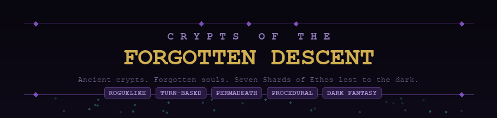
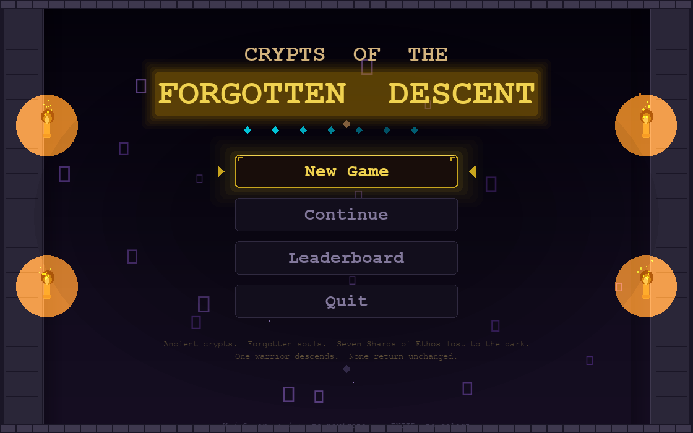
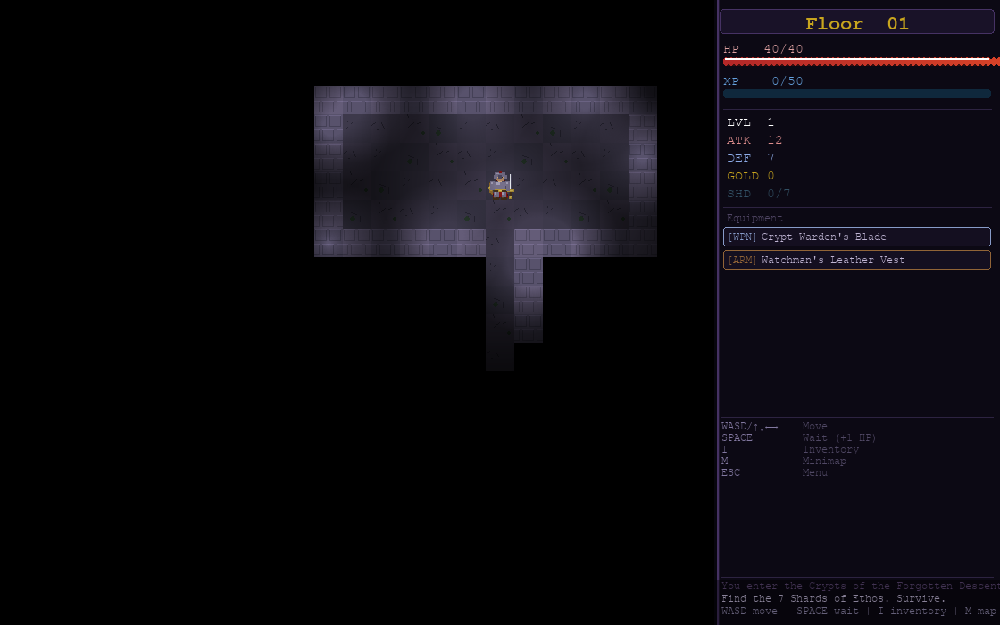
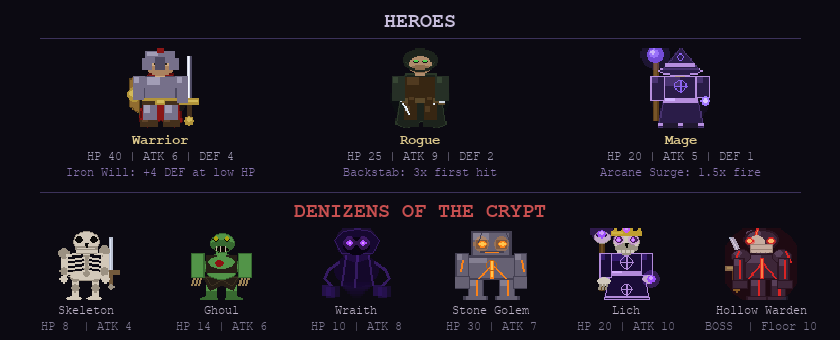

<p align="center">
  
</p>

<p align="center">
  <a href="#-features"></a>
  <a href="#-installation"></a>
  <a href="#-installation"></a>
  <a href="LICENSE"></a>
  
</p>

<p align="center">
  <em>Deep beneath the ruins of Valdris lies a labyrinth carved not by human hands, but by something far older.<br>
  You are a Descender — a relic-hunter hired to recover the seven Shards of Ethos.<br>
  No one who has entered has ever returned. You intend to be the first.</em>
</p>

---

## Screenshots

<p align="center">
  <br>
  <sub>Main menu with animated torches and lore text</sub>
</p>

<p align="center">
  <br>
  <sub>Floor 1 — FOV lighting, tile-based dungeon, HUD with stats and equipment</sub>
</p>

---

## Features

**Dungeon**
- 10 procedurally generated floors using Binary Space Partitioning (BSP)
- Field-of-view system with 360-ray raycasting and persistent fog of war
- Locked rooms requiring Dungeon Keys found elsewhere on the floor
- Shrine altars offering randomized blessings on floors 2, 4, 6, and 8

**Combat**
- Turn-based bump-to-attack melee with critical hits, lifesteal, and status effects
- 5 distinct enemy types with FSM-driven AI and BFS pathfinding
- Multi-phase final boss (Hollow Warden) with summons, AOE slams, and phase transitions
- AoE consumables — bombs (adjacent) and fire scrolls (floor-wide)

**Progression**
- 3 character classes with unique passives: Warrior, Rogue, Mage
- 18 items across weapons, armor, consumables, and quest items
- Equipment scaling from early-floor finds to endgame legendaries
- XP / level-up system with stat growth up to level 20

**Systems**
- Full inventory management with item comparison tooltips
- Permadeath — death deletes your save permanently
- Auto-save on every floor descent
- SQLite leaderboard tracking your best runs
- Toggleable minimap overlay

---

## Characters

<p align="center">
  <br>
</p>

### Player Classes

| | Warrior | Rogue | Mage |
|---|---|---|---|
| **HP** | 40 | 25 | 20 |
| **ATK** | 6 | 9 | 5 |
| **DEF** | 4 | 2 | 1 |
| **Passive** | **Iron Will** — +4 DEF when HP drops below 25% | **Backstab** — 3x damage on the first hit against each enemy | **Arcane Surge** — fire scrolls deal 1.5x damage |
| **Starting Gear** | Crypt Warden's Blade, Watchman's Leather Vest, Vial of Crimson Essence | Gravekeeper's Fang, 2x Crypt Grenade, 2x Vial of Crimson Essence | 2x Ember Scroll, Elixir of Restoration |

### Enemies

| Enemy | Floor | Special | Description |
|---|---|---|---|
| **Skeleton** | 1+ | — | Basic undead. Low stats, appears in numbers. |
| **Ghoul** | 2+ | Bleed (1 HP/turn, 8 turns) | Decayed humanoid. Inflicts bleeding wounds. |
| **Wraith** | 3+ | Phase (ignores DEF) | Ghostly specter. Passes through walls. Ignores armor. |
| **Stone Golem** | 4+ | Stun (2x damage, skip turn) | Massive construct. High HP and DEF. Devastating stun attacks. |
| **Lich** | 7+ | Curse (halve ATK/DEF, 4 turns) | Undead mage. Curses weaken you. Dangerous at range. |
| **Hollow Warden** | 10 | 3-phase boss | The final guardian. Summons minions, charges with double speed, and unleashes AOE slams. |

All enemies scale with floor depth: **+3 HP and +1 ATK per 2 floors**.

---

## Installation

**Requirements:** Python 3.10+ and Pygame 2.x

```bash
# Clone the repository
git clone https://github.com/AndrewDizon0556/Crypts-of-the-Forgotten-Descent.git
cd Crypts-of-the-Forgotten-Descent

# Install dependencies
pip install -r requirements.txt

# Run the game
cd crypts_of_the_forgotten_descent
python main.py
```

---

## Controls

| Key | Action |
|---|---|
| `WASD` / Arrow keys | Move / bump-attack |
| `SPACE` | Wait one turn (+1 HP) |
| `I` | Open inventory |
| `M` | Toggle minimap |
| `ESC` | Menu / close overlay |

**Inventory:** `Up/Down` navigate, `E` use/equip, `D` drop

**Shrine:** `Up/Down` choose boon, `E/Enter` accept, `ESC` leave

---

## Game Mechanics

### Dungeon Generation

Each floor is procedurally built using **Binary Space Partitioning**:
1. A 60x40 tile map is recursively partitioned into regions
2. Rooms (5-15 wide, 4-10 tall) are placed in each partition
3. L-shaped corridors connect all rooms
4. BFS validation ensures full connectivity
5. On floors 3+, one room is sealed behind locked doors — find the key

### Combat Formula

```
Player damage = max(1, ATK - enemy.DEF + random(-1, 2))
Enemy damage  = max(1, enemy.ATK - player.DEF + random(-1, 2))
```
- **10% critical hit** chance (2x damage)
- **Rogue backstab** applies 3x on the first hit per enemy (stacks with crit = 6x)
- **Wraith** attacks ignore player DEF entirely

### Scoring

```
Score = (floors x 100) + (kills x 10) + (gold x 2) + (shards x 200) + turns + 5000 (victory)
```

Top 10 scores are saved to a local SQLite leaderboard.

### The Hollow Warden

The boss awaits on **Floor 10** with three escalating phases:

| Phase | Trigger | Behavior |
|---|---|---|
| Phase 1 | Start | Normal movement. Summons Skeletons. |
| Phase 2 | HP < 66% | Double movement speed. Bleeding aura. Summons Ghouls. |
| Phase 3 | HP < 33% | Boosted ATK (25). AOE slam (15 dmg). Summons Wraiths. |

---

## Project Structure

```
crypts_of_the_forgotten_descent/
├── main.py                    Entry point
├── game.py                    Core game loop and state machine
├── config.py                  Constants and tuning values
│
├── entities/
│   ├── player.py              Player classes, stats, passives
│   ├── enemy.py               Enemy types, FSM states, floor scaling
│   └── boss.py                Hollow Warden — 3-phase boss AI
│
├── systems/
│   ├── dungeon.py             BSP dungeon generator
│   ├── fov.py                 360-ray field-of-view
│   ├── combat.py              Damage formulas, crits, AoE, status ticks
│   ├── inventory.py           Item definitions, equip/use logic
│   ├── ai.py                  BFS pathfinding, enemy FSM
│   ├── save.py                JSON save/load with permadeath
│   └── score.py               SQLite leaderboard
│
├── ui/
│   ├── renderer.py            Tile renderer with camera and lighting
│   ├── hud.py                 Stats panel, message log, controls
│   ├── menus.py               Title, character select, death/victory screens
│   ├── inventory_ui.py        Inventory overlay with item comparison
│   ├── shrine_ui.py           Shrine boon selection
│   ├── minimap.py             Minimap toggle overlay
│   ├── sprite_loader.py       Procedural character sprites and tile art
│   ├── camera.py              Viewport tracking
│   ├── lighting.py            Dynamic FOV lighting
│   ├── particles.py           Particle effects
│   └── effects.py             Floating damage numbers
│
└── data/
    ├── items.json             18 item definitions
    ├── enemies.json           5 enemy type definitions
    └── scores.db              Leaderboard (created at runtime)
```

---

## Roadmap

- [x] Procedural dungeon generation (BSP)
- [x] Core combat, AI, and turn system
- [x] 3 playable classes with unique passives
- [x] Inventory, equipment, and item scaling
- [x] Shrine blessings and Shard of Ethos collection
- [x] Wraith wall-phasing and status effects
- [x] Multi-phase boss fight (Hollow Warden)
- [x] Save/load with permadeath
- [x] Death and victory screens with scoring
- [x] Locked rooms with key mechanics
- [x] Procedural character sprites for all entities
- [ ] Sound effects and ambient audio
- [ ] More item variety and rare drops
- [ ] Additional enemy types (floors 5-9)
- [ ] Item enchantment system

---

## Tech Stack

| Component | Technology |
|---|---|
| Language | Python 3.10+ |
| Graphics | Pygame 2.x |
| Dungeon Gen | Binary Space Partitioning (BSP) |
| Pathfinding | Breadth-First Search (BFS) |
| AI | Finite State Machine (IDLE / CHASE / ATTACK) |
| FOV | 360-degree raycasting |
| Persistence | JSON (saves), SQLite (leaderboard) |
| Sprites | Procedural (`pygame.draw` — no external assets required) |

---

## License

This project is licensed under the **MIT License** — see [LICENSE](LICENSE) for details.

---

<p align="center">
  <em>Descend. Collect. Survive.</em><br>
  <sub>Designed and developed by Vic Andrew A. Dizon</sub>
</p>
